# PDF Embedding Code Attacks

PDF supports a lot of content formats such as text, HTML, CSS, JavaScript, etc.
You can also attach files in pdf files.
With the ability of using JavaScript in pdf files, there might be vulnerability.
The abstraction of this attack is to attach an executable file or a bash script, and use JavaScript to download the attachment then execute the file.

## PyPDF2

My approach uses PyPDF2 library to achieve the operation we discussed above.
PyPDF2 supports file attachment to a pdf file, the function I am using is `addAttachment(filename, data)`.
The function for embedding JavaScript is `addJS(script)`.

## Acrobat

Acrobat provides several functions and properties for manipulating the file attachments.
The function I am using here is `this.exportDataObject({cName: filename,nLaunch: option})`.
We are using option "2" for the nLaunch argument which enable the "download then execute" operation.

## Results

After creating a new file with `pdf_inject.py`, we open the pdf file with Adobe Acrobat Reader.
_(You need to use this reader to execute the JavaScript)_

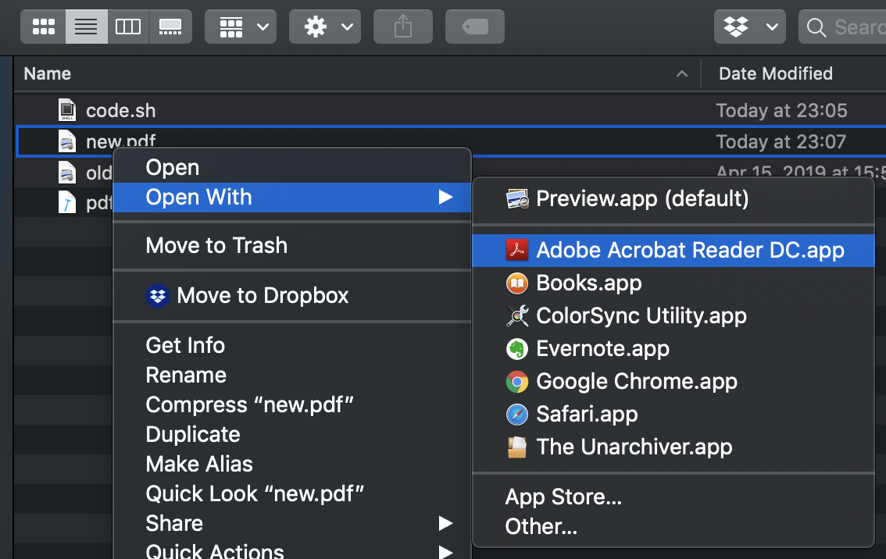

You can see there's a `mock.txt` file attached to the pdf file.
The original file I attached to it was sh file but I mocked the format as a text file.

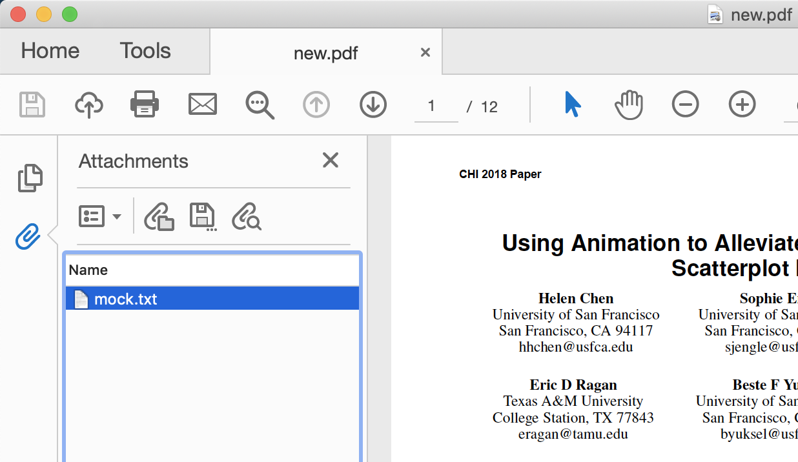

The Acrobat Reader detected the attachment was not text file so it pop out a window to ask if the user would like to download the file or not.
It also warned the user that this could be a malicious code.

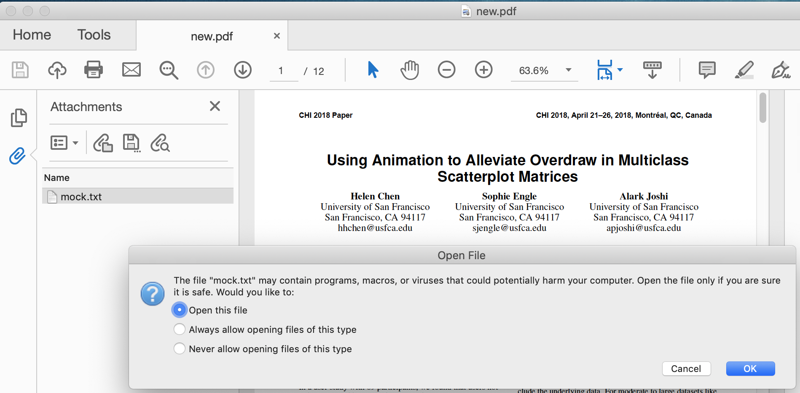

Not thing happened if you really open the file.

The newer version of Adobe Acrobat Reader has some mechanisms to prevent the attack like this.
I am looking into some other ways to achieve the goal.

# Pshing Email

I used an open source phishing framework called GoPhish.
Here is the frontend of this framework.

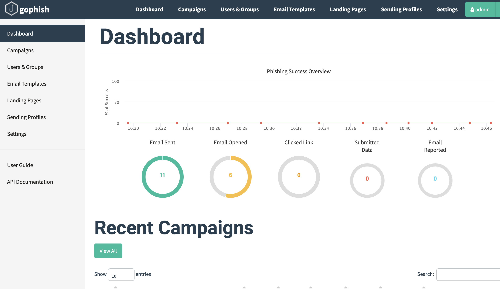

## Sending Profile

Create a profile for sending email with `smtp.gmail.com` and enter the email account information for sender.

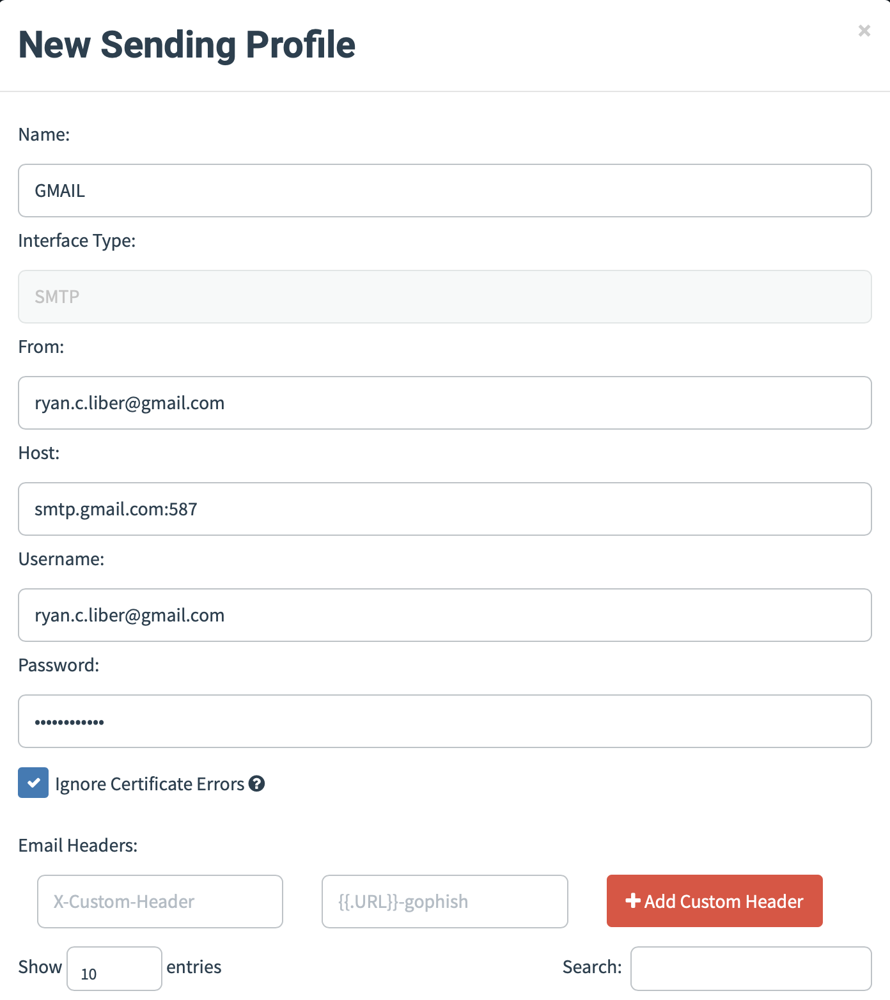

## Landing Pages

Create a landing page with html when user click any url in the email.
You can also import from a existing site.
For example, LinkedIn login page.
The information user input to this landing page will be report to me.

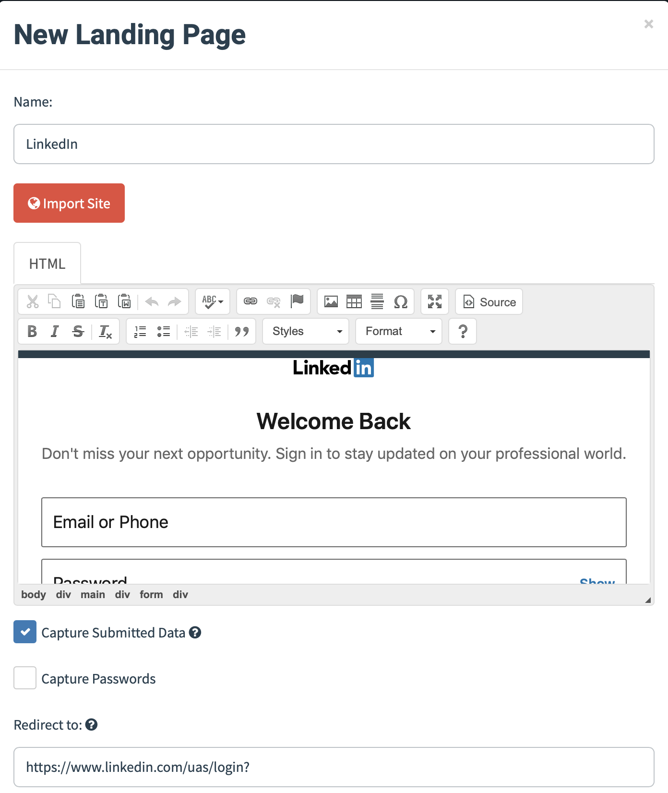

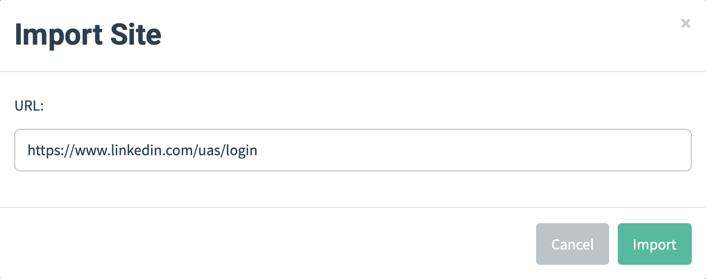

## Email Template

Create a email template with html which will be the content in this phishing email.
You can also import from a existing email.
This is a spear phishing since I am targeting a very specific person with his personal information and the content he/she might be interested in.

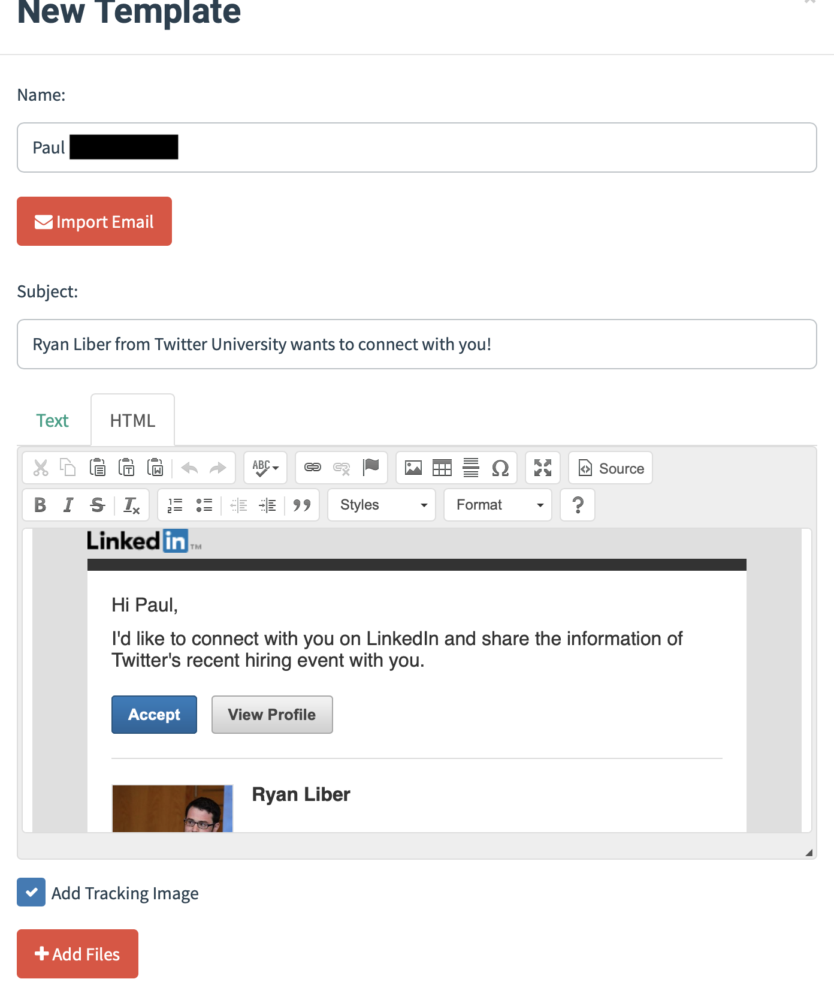

## User and Group

Create user and group for receiver information.

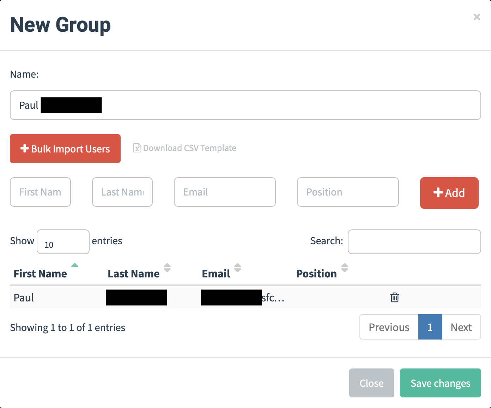

## Campaigns

Create a campaign for the target with all the setups above.

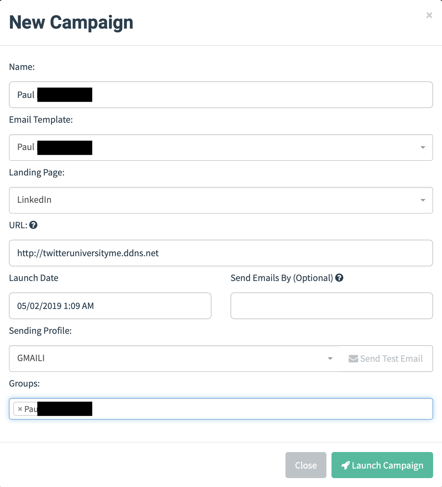

## Result Tracking

After sending the phishing email.
The framework will keep tracking the states of the attack.
You will see the information like whether the target opens the email or click the url, etc.

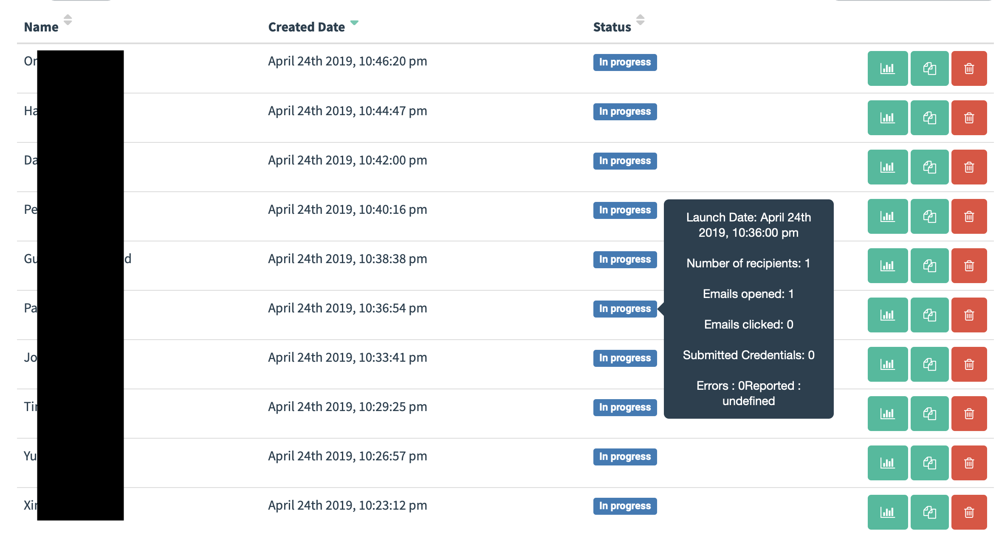

## Author

Chien-Yu (Brian) Sung

## References

0. [PyPDF2](https://pythonhosted.org/PyPDF2/PdfFileWriter.html?highlight=addAttachment)
1. [Acrobat](https://acrobatusers.com/tutorials/importing-and-exporting-pdf-file-attachments-acrobat-javascript)
1. [GoPhish](https://getgophish.com)
